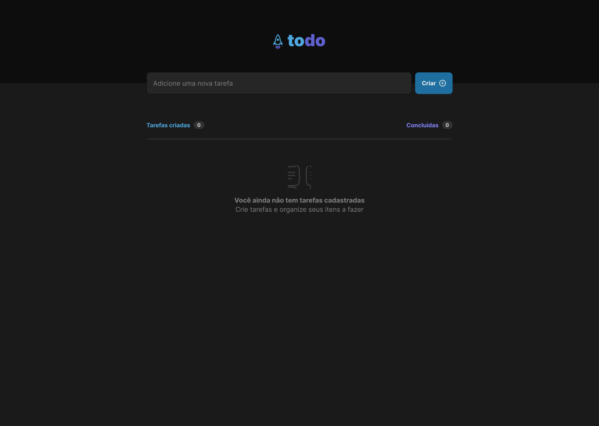
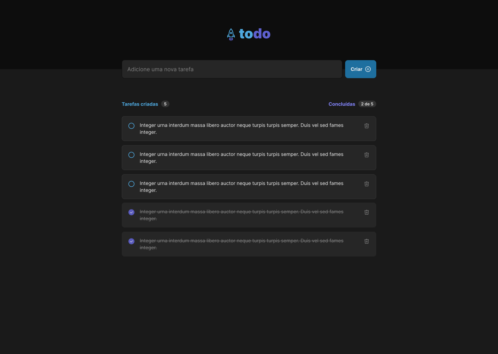

<h1 align="center">
Desafio referente ao módulo: Fundamentos do React.js - Curso Ignite da Rocketseat 📝
</h1>

Nesse desafio desenvolvemos uma aplicação de controle de tarefas no estilo to-do list. 

  

  

## Funcionalidades

- [x] Adicionar uma nova tarefa
- [x] Marcar e desmarcar uma tarefa como concluída
- [x] Remover uma tarefa da listagem
- [x] Mostrar o progresso de conclusão das tarefas

  entre outras.

## Techs

- [x] TypeScript
- [x] React.js

Feito com ♥ by Gabi Lemos 👋
